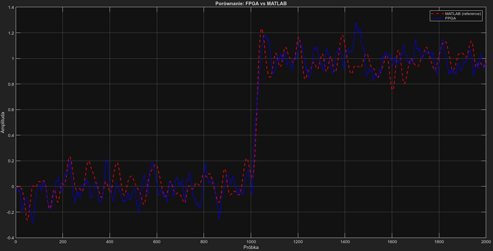
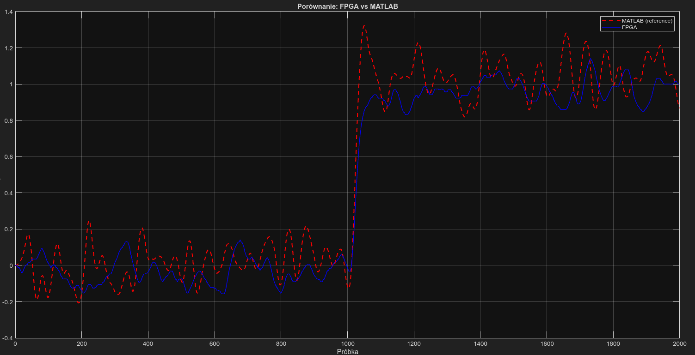
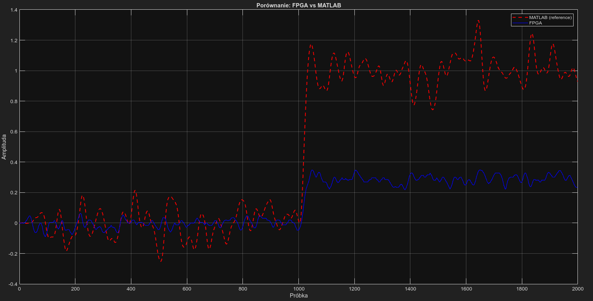

### FPGA implementation

The filter was successfully implemented and synthesized on a Xilinx FPGA device.
The design utilizes dedicated DSP48E1 slices for multiply–accumulate operations within the biquad sections, ensuring efficient resource usage and high-performance signal processing.

The AXI4-Stream based architecture allows seamless integration into FPGA-based DSP pipelines and supports high-throughput streaming data processing.
### Design focus
- IIR Butterworth filter design
- Cascade of second-order sections (biquads)
- AXI4-Stream based dataflow
- FPGA implementation using DSP48E1 slices
- MATLAB reference model and verification

#### Second-order Butterworth filter (single biquad)

This plot presents the frequency response of a single second-order Butterworth IIR filter (biquad).

#### Cascaded biquads with identical coefficients

This plot shows the response of two cascaded second-order Butterworth filters using identical coefficients.
The purpose of this configuration is to demonstrate the effect of cascading biquad sections and the resulting increase in filter order.

### MATLAB vs FPGA implementation (SOS with different coefficients)

This plot compares the MATLAB reference model with the FPGA implementation of the fourth-order Butterworth filter.
The final design uses a cascade of two biquad sections with different coefficients, derived from a second-order section (SOS) decomposition.
